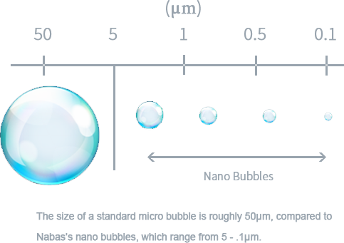

_Preliminary, experimental, incomplete, undocumented, and generally unsuitable for anything. Expect everything to change._

# nano library

Tiny function library useful for Custom Elements.

Custom Elements depend on bits of the Web Components standard platform itself. Specifically, CustomElements and HTMLImports feature support is expected.

These features are natively available in Chrome, and otherwise supported by [web-componentsjs polyfills](https://github.com/webcomponents/webcomponentsjs). These elements do not depend on ShadowDOM, so [webcomponents-lite](https://polygit.org/components/webcomponentsjs/webcomponents.min.js) is sufficient.

# Nano Manifesto

## Web Components are Good and True

In all their aspects, including shadow-dom and the new recruit, css property-bags.

## Mindshare is Success

Nuf said.

## Foundations

### Interoperability
Large-scale reuse and sharing, utilize existing DOM contract.

### Platformophilia
Use the Web Platform, embrace the DOM, avoid abstracting the surface or using as render-target.
 
## (Web) App Needs

### Performance

- Payload Size
- Time To First Paint (TTFP)
- RAIL

### Other Features

- Deep linking
- i18n
- a11y
- Polish
- Animation
- Offline/Progressive/Applike (Fizzy)

### Code Cost Cutting

- KISS
- DRY
- Reuse

### Maintenance Cost Cutting

- KISS
a- Be nimble
- Be expressive
- Be readable
- Be robust

## People Can't Know What They Want Until They Have What They Need

#### Platformophilia Can Satisfy Needs

Custom Elements exposes DOM's fundamental power as a component-model. Component power enables us to surmount the Web App needs in a satisfying manner.

#### Interoperability Will Fulfill Wants

Once _making it work_ is less of a burden, it's easier to grasp the importance of the deep interoperability afforded by Shadow DOM and css-scoping. At that time the large-scale sharing afforded by the pure element interface will be attractive (i.e. no special distribution rules, etc).

